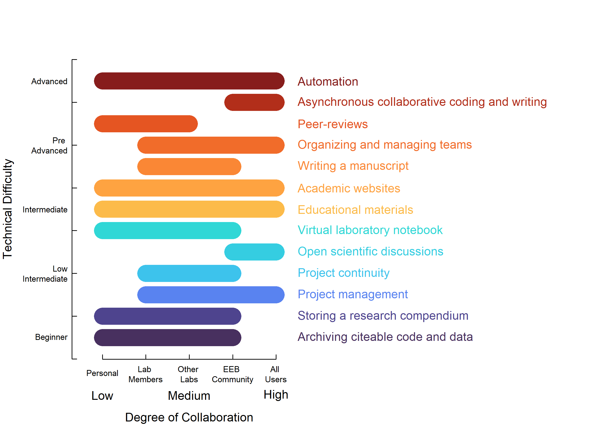

---
output:
  bookdown::pdf_document2:
      latex_engine: xelatex
      number_sections: false
      toc: false
mainfont: "Times New Roman"
geometry: margin = 1in
spacing: double
fontsize: 11pt
editor_options:
  markdown:
    wrap: sentence
csl: https://raw.githubusercontent.com/marlonecobos/kuenm/master/ecography.csl
link-citations: yes
header-includes:
   - \usepackage{lineno}
   - \linenumbers
   - \usepackage{setspace}\doublespacing
   - \usepackage{parskip}
   - \setlength{\parindent}{0em}
   - \setlength{\parskip}{1em}
   - \usepackage{caption}
   - \usepackage{pdflscape}
   - \newcommand{\blandscape}{\begin{landscape}}
   - \newcommand{\elandscape}{\end{landscape}}
---

```{r setup, include=FALSE}
knitr::opts_chunk$set(echo = TRUE)

library(googlesheets4)
library(here)
library(readr)
library(dplyr)
library(kableExtra)

scatterblob_data <- read_csv(here("data", "scatterblob_data_raw.csv"))
uses <- scatterblob_data$`Ways to use GitHub`
column_names <- colnames(scatterblob_data[1:8])

```

## Study

### Not just for programmers: How GitHub can accelerate collaborative and reproducible research in ecology and evolution 

### Supplementary Information 1

### Representing technical difficulty and degree of collaboration in use cases for Github in ecology and evolution

**Appendix S1.1. Computing indices of technical difficulty and degree of collaboration**

We aimed at distributing the use cases discussed in our study across gradients of technical difficulty and collaboration.
For this, we estimated the perceived degree of collaboration and the perceived level of technical difficulty for each use case.

**Degree of collaboration**

We determined the degree of collaboration for each GitHub use case as the range of collaborative contexts that can be achieved with each tool, as perceived by the authors.
We attributed five levels of possible collaboration in the context of ecology and evolutionary biology research (see Table S1.1).

**Table S1.1.** Classification of depress of collaboration attributed to the use cases for GitHub in research in the field of ecology and evolutionary biology.

| Level |           Degree of collaboration         |
| ----: | ----------------------------------------: |
|     1 |                                Individual |
|     2 |      Laboratory or group of collaborators |
|     3 |         An organisation, or multiple labs |
|     4 |                    The research community |
|     5 |                        The general public |

Finally, we determined the minimum and maximum degree of collaboration from these levels for each GitHub use case.

**Technical difficulty**

We then assessed the technical difficulty of GitHub use cases in terms of their cognitive load. 

We measured the perceived technical difficulty of each GitHub use case as the degree of difficulty as perceived by the authors, based on personal experience. 
This metric represents a consensus value among the authors, though the perceived degree of difficulty will ultimately vary among GitHub users depending on each person's previous experience with these use cases.

The table we used to quantify cognitive load was assembled collaboratively using Google Sheets, then manually saved as a `CSV` file called `cognitive_load_table.csv` in the `data` folder. 
Specifically, :

1.  We first created a list of skills that are needed to implement different GitHub uses. These occupied a column each; 
2.  For each GitHub use listed on the first column, we went through each column, and marked a 1 if a skill was needed for that particular GitHub use, and zero if the skill was not needed;
3.  The sum of values across columns provides a measure of cognitive load required for a user that is a "GitHub beginner" to implement any GitHub use. The column *`r column_names[3]`* reflects this number;
4.  As many GitHub uses tied with the same cognitive load value, we resourced to perceived difficulty to break ties and avoid overlap of uses in the figure, mainly to improve visualization of the data. The column *`r column_names[5]`* shows this adjustment;
5.  Finally, we ordered the GitHub uses in increasing order following *`r column_names[5]`*, and assigned a sequential value of cognitive load, from one to *maximum number of GitHub uses*. This is column *`r column_names[4]`*.

The collaborative Google Sheet used to quantify cognitive load is also available at the following link: [https://docs.google.com/spreadsheets/d/1YipCCdg5Z8w-IQO67rFfMBSTpLjO-_7HiW44gqzTXPM/edit#gid=0](https://docs.google.com/spreadsheets/d/1YipCCdg5Z8w-IQO67rFfMBSTpLjO-_7HiW44gqzTXPM/edit#gid=0).

\noindent
\newpage

**Appendix S1.2. Annotated code and prose allowing the representation of indices of technical difficulty and degree of collaboration**

Here, we provide the annotated `R` code and instructions that are required to load and present the indices of technical difficulty and degree of collaboration of the eleven use cases of GitHub we present in our piece.

We used Google Docs and Google Sheets to collect and manipulate data, and plotted results using the basic visualisation functions from `R` version 4.02.

### Data collection

These data were assembled collaboratively using Google Docs following the methodology described in Appendix S1.1. then manually saved as a `CSV` file called `scatterblob_data_raw.csv` in the `data` folder. 
The collaborative Google Spreadsheet is also accessible at the following link: [https://docs.google.com/spreadsheets/d/1zCRgctjfjE2xZN9MkqfFh222K6bvVvA3gT0UdkL_CS8/](https://docs.google.com/spreadsheets/d/1zCRgctjfjE2xZN9MkqfFh222K6bvVvA3gT0UdkL_CS8). 


\newpage

\captionsetup[table]{labelformat=empty}

```{r table, echo=F}
to_print = scatterblob_data[-6,-c(2, 3, 5,9:11)]
colnames(to_print) = c("GitHub Use Cases", 
                       "Cognitive Load",
                       "Technical Difficulty",
                       "Degree of Collaboration (Minimum)",
                       "Degree of Collaboration (Maximum)")
knitr::kable(to_print, 
             label = "data",
             caption = "'\\textbf{Table S1.2.} Indices of technical difficulty and degree of collaboration for each GitHub use case. The first column lists the GitHub use cases that were addressed in the main text. Indices were assessed collaboratively following the steps in Appendix S1.1.",
             align = c('l','c','c','c','c'),
             booktabs = T) %>% 
  kableExtra::column_spec(1, width = "3.5cm") %>%
  kableExtra::column_spec(2:5, width = "2cm")
```

\newpage

### Creating Figure 2: A summary of ways GitHub can be used showing technical difficulty and degree of collaboration for each use case.

1. Loading the data `CSV` file:

```{r, message=FALSE, collapse=TRUE}
scatterblob_data <- read_csv(here("data", "scatterblob_data_raw.csv"))
```

2. Cleaning the raw data and saving it as a `my_data` object:

```{r}
# names(scatterblob_data)
scatterblob_data$x1 <- scatterblob_data$`Min degree of collaboration X1`
scatterblob_data$x2 <- scatterblob_data$`Max degree of collaboration X2`
scatterblob_data$y_real <- scatterblob_data$`Cognitive load - real - non-overlapping`
scatterblob_data$y_seq <- scatterblob_data$`Cognitive load - sequential`
my_data <- scatterblob_data[-6, c("Ways to use GitHub","y_seq", "y_real", "x1", "x2")]
my_data$y_seq <- 1:12
```

```{r}
outpath <- here("content", "images")
```

3. Plotting cognitive load

We used the colour palette `turbo` from the R package [`viridis`](https://cran.r-project.org/web/packages/viridis/vignettes/intro-to-viridis.html#the-color-scales):

```{r plot-segments}
my_colors <- viridis::turbo(n = 100, alpha = 0.9)[c(2, 
                                                    5, 
                                                    15, 
                                                    26, 
                                                    30,
                                                    68, 
                                                    72, 
                                                    76,
                                                    80,
                                                    84,
                                                    94,
                                                    100)]

plot_name <- "scatterblob_1-viridis-turbo"

###############################################################
# start the png connection and set graphical parameters
###############################################################

plot_format <- "png"
if (plot_format == "png") {
  png(file = here(outpath, paste0(plot_name, ".png")),
      width = 8.25,
      height = 6,
      units = "in",
      res = 600,
      bg = "white")  
}

par(xpd = NA,
    mai = c(1.02, 1, 0.82, 4),
    bty = "n")

###############################################################
# create the plot background
###############################################################

plot(x = c(0.5, 5.5),
     y = c(0.5, 12.5),
     xlab = "",
     ylab = "",
     col = "white",
     # "hide" the tick labels so we can put some words instead of numbers:
     col.axis = "white",
     tck = 0.02,
     yaxt = "n"
     # yaxs = 'i'
     )

title(ylab = "Technical Difficulty", 
      line = 4, 
      cex.lab = 1)

title(xlab = "Degree of Collaboration", 
      line = 3.5, 
      cex.lab = 1)

###############################################################
# add tick labels
###############################################################

axis(2,
     seq(1, 12, length.out = 5),
     outer = F,
     labels = F,
     pos = 0.5,
     hadj = 1)

text(x = 1:5,
     y = c(-0.65, rep(-0.7, 4)), 
     cex = 0.7,
     labels = c("Personal", 
                "Lab \nMembers", 
                "Other \nLabs", 
                "EEB \nCommunity", 
                "All \nUsers"))

text(x = c(0.5, 3, 5),
     y = -1.7, 
     labels = c("Low", "Medium", "High"))

# Technical difficulty levels from https://www.londonschool.com/level-scale/
text(x = 0.2,
     y = seq(1, 12, length.out = 5),
     cex = 0.7,
     adj = 1,
     labels = c("Beginner",
                "Low\nIntermediate",
                "Intermediate", 
                "Pre \nAdvanced",
                "Advanced"))

###############################################################
# plot scatter blobs on sequential cognitive load
###############################################################
for (i in seq(nrow(my_data))) {
  X0 <- my_data$x1[i]
  X1 <- my_data$x2[i]
  Y <- my_data$y_seq[i]
  if (X0 == X1) {
    X0 <- X0 - 0.01
    X1 <- X1 + 0.01
   }
  segments(x0 = X0,
           x1 = X1,
           y0 = Y,
           col = my_colors[i],
           lwd = 23)
}

###############################################################
# add github uses text
###############################################################
text(x = 5.5,
    y = my_data$y_seq,
    labels = my_data$`Ways to use GitHub`,
    adj = 0,
    col = my_colors)

dev.off()
```

