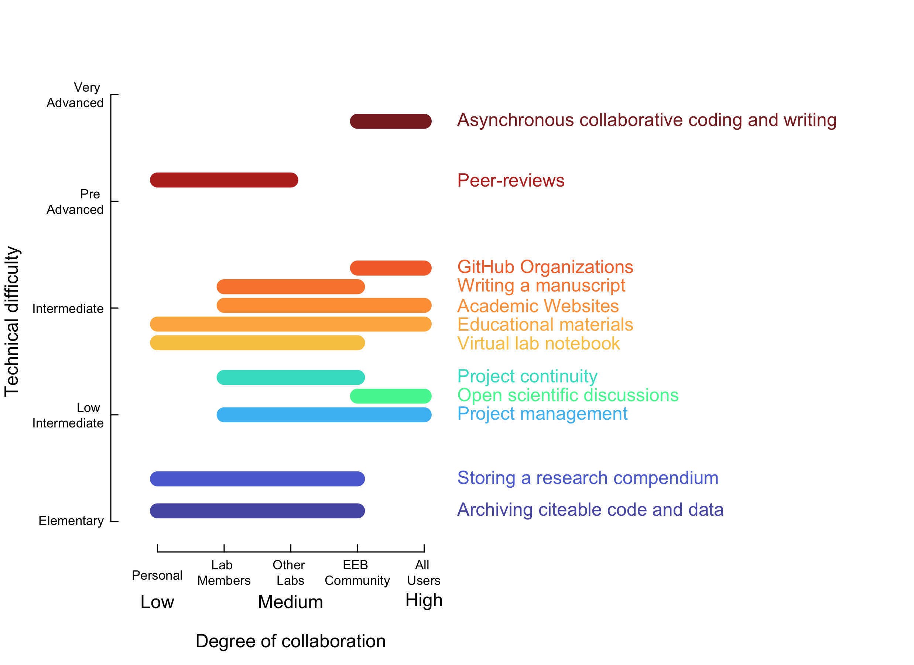
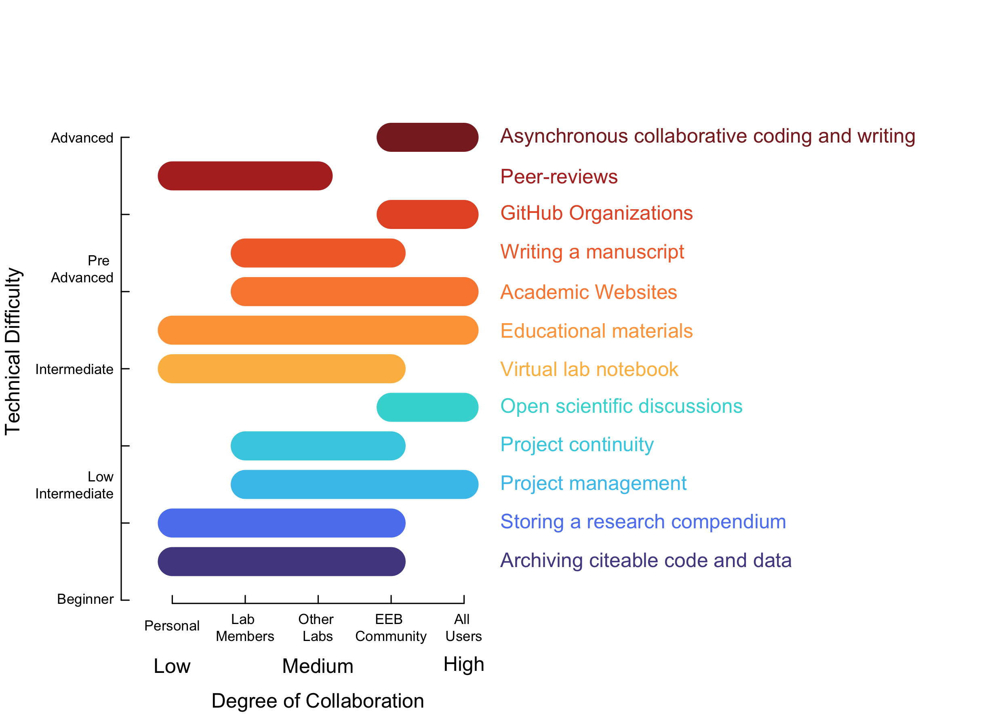

---
output:
  bookdown::pdf_document2:
      latex_engine: xelatex
      number_sections: false
      toc: false
mainfont: "Times New Roman"
geometry: margin = 1in
spacing: double
fontsize: 11pt
editor_options:
  markdown:
    wrap: sentence
csl: https://raw.githubusercontent.com/marlonecobos/kuenm/master/ecography.csl
link-citations: yes
header-includes:
   - \usepackage{lineno}
   - \linenumbers
   - \usepackage{setspace}\doublespacing
   - \usepackage{parskip}
   - \setlength{\parindent}{4em}
   - \setlength{\parskip}{0em}
   - \usepackage{caption}
   - \usepackage{pdflscape}
   - \newcommand{\blandscape}{\begin{landscape}}
   - \newcommand{\elandscape}{\end{landscape}}
---


## Study

### Not just for programmers: How GitHub can accelerate collaborative and reproducible research in ecology and evolution 

### Supplementary Information 1

### Representing technical difficulty and degree of collaboration in use cases for Github in ecology and evolution

**Appendix S1.1. Computing indices of technical difficulty and degree of collaboration**

We aimed at distributing the use cases discussed in our study across gradients of technical difficulty and collaboration.
For this, we estimated the perceived degree of collaboration and the perceived level of technical difficulty for each use case.
Each author attributed a value ranging from 1 to 10 to their perceived degree of collaboration for a use case, with one representing a use case that offer very low advantages in terms of collaboration, while ten classified that use case as highly advantageous in terms of collaboration.

We then [\...].

We used Google Docs and Google Sheets to manipulate data, and plotted results using the basic visualisation functions from `R` version 4.02.

\noindent
**Appendix S1.2. Annotated code and prose allowing the representation of indices of technical difficulty and degree of collaboration**

Here, we provide the annotated `R` code and instructions that are required to load and present the indices of technical difficulty and degree of collaboration of the eleven use cases of GitHub we present in our piece.

(May be removed) **Goal**: This is a summary figure, e.g., here are all the ways and here are the entry points with low technical difficulty, some for beginners and some more advanced ways to use GitHub.

(May be removed) **Highlight**: There are ways to use github that allow different degrees of collaboration that do not require too many technical skills.

### Data

Data was assembled collaboratively using Google Docs, then manually saved as a `CSV` file called `scatterblob_data_raw.csv` in the `data` folder.

The collaborative [Google Spreadsheet](https://docs.google.com/spreadsheets/d/1zCRgctjfjE2xZN9MkqfFh222K6bvVvA3gT0UdkL_CS8/edit#gid=0) features a first column listing the ways to use GitHub that were addressed in the manuscript (Archiving citeable code and data; Storing a research compendium; Project management; Project continuity; Open scientific discussions; Virtual laboratory notebook; Educational materials; Academic websites; Writing a manuscript; Organizing and managing teams; Peer-reviews; Asynchronous collaborative coding and writing; Automation).

The column *Perceived Technical difficulty* corresponds to the degree of difficulty that was perceived by the authors when assembling the data, based on personal experience.
We quickly realized this varied greatly across authors, and that this variation seemed to depend on which github tools were previously known or mastered by the authors.

The columns tagged as *Cognitive load -* showcase a different way to assess technical difficulty of GitHub uses, measured as cognitive load (explained in the next section).

The columns tagged as *degree of collaboration* showcase the span of collaboration that can be achieved with each tool, as perceived by the authors.

### Measuring degree of technical difficulty

[Cognitive load](https://docs.google.com/spreadsheets/d/1YipCCdg5Z8w-IQO67rFfMBSTpLjO-_7HiW44gqzTXPM/edit#gid=0) was measured as follows:

1.  We first created a list of skills that are needed to implement different GitHub uses. These occupied a column each.
2.  For each GitHub use listed on the first column, we went through each column, and marked a 1 if a skill was needed for that particular GitHub use, and 0 if the skill was not needed.
3.  The sum of values across columns provides a measure of cognitive load required for a user that is a "GitHub beginner" to implement any GitHub use. The column *Cognitive load - real* reflects this number.
4.  As many GitHub uses tied with the same cognitive load value, we resourced to perceived difficulty to break ties and avoid overlap of uses in the figure, mainly to improve visualization of the data. The column *Cognitive load - real - non-overlapping* shows this adjustment.
5.  Finally, we ordered the GitHub uses in increasing order following *Cognitive load - real - non-overlapping*, and assigned a sequential value of cognitive load, from 1 to *maximum number of GitHub uses*. This is column *Cognitive load - sequential*

## Leading the data `CSV` file:


```r
scatterblob_data <- read_csv(here("data", "scatterblob_data_raw.csv"))
```

```
## New names:
## Rows: 13 Columns: 11
## -- Column specification
## -------------------------------------------------------- Delimiter: "," chr
## (5): Ways to use GitHub, Alternative title, Example, ...10, ...11 dbl (6):
## Cognitive load - real, Cognitive load - sequential, Cognitive load ...
## i Use `spec()` to retrieve the full column specification for this data. i
## Specify the column types or set `show_col_types = FALSE` to quiet this message.
## * `` -> `...10`
## * `` -> `...11`
```

```r
head(scatterblob_data)
```

```
## # A tibble: 6 x 11
##   Ways t~1 Alter~2 Cogni~3 Cogni~4 Cogni~5 Perce~6 Min d~7 Max d~8 Example ...10
##   <chr>    <chr>     <dbl>   <dbl>   <dbl>   <dbl>   <dbl>   <dbl> <chr>   <chr>
## 1 Archivi~ Citeab~       2       1    2.2        1       1       4 link    <NA> 
## 2 Storing~ Workin~       2       2    2.8        1       1       4 life-l~ 1 = ~
## 3 Project~ Projec~       4       3    4          1       2       5 (e.g.,~ 4 = ~
## 4 Project~ Projec~       4       4    4.7        1       2       4 <NA>    4 = ~
## 5 Open sc~ Develo~       4       5    4.35       1       4       5 https:~ 3 = ~
## 6 Virtual~ Lab ma~       5       6    5.35       4       1       4 link 1~ 3 = ~
## # ... with 1 more variable: ...11 <chr>, and abbreviated variable names
## #   1: `Ways to use GitHub`, 2: `Alternative title`,
## #   3: `Cognitive load - real`, 4: `Cognitive load - sequential`,
## #   5: `Cognitive load - real - non-overlapping`,
## #   6: `Perceived Technical difficulty`, 7: `Min degree of collaboration X1`,
## #   8: `Max degree of collaboration X2`
```

```r
#  View(scatterblob_data)
```

Cleaning the raw data and saving it as a `my_data` object:


```r
names(scatterblob_data)
```

```
##  [1] "Ways to use GitHub"                     
##  [2] "Alternative title"                      
##  [3] "Cognitive load - real"                  
##  [4] "Cognitive load - sequential"            
##  [5] "Cognitive load - real - non-overlapping"
##  [6] "Perceived Technical difficulty"         
##  [7] "Min degree of collaboration X1"         
##  [8] "Max degree of collaboration X2"         
##  [9] "Example"                                
## [10] "...10"                                  
## [11] "...11"
```

```r
scatterblob_data$x1 <- scatterblob_data$`Min degree of collaboration X1`
scatterblob_data$x2 <- scatterblob_data$`Max degree of collaboration X2`
scatterblob_data$y_real <- scatterblob_data$`Cognitive load - real - non-overlapping`
scatterblob_data$y_seq <- scatterblob_data$`Cognitive load - sequential`
my_data <- scatterblob_data[1:13,c("Ways to use GitHub","y_seq", "y_real", "x1", "x2")]
my_data
```

```
## # A tibble: 13 x 5
##    `Ways to use GitHub`                          y_seq y_real    x1    x2
##    <chr>                                         <dbl>  <dbl> <dbl> <dbl>
##  1 Archiving citeable code and data                  1   2.2      1     4
##  2 Storing a research compendium                     2   2.8      1     4
##  3 Project management                                3   4        2     5
##  4 Project continuity                                4   4.7      2     4
##  5 Open scientific discussions                       5   4.35     4     5
##  6 Virtual laboratory notebook                       6   5.35     1     4
##  7 Educational materials                             7   5.7      1     5
##  8 Academic websites                                 8   6.05     1     5
##  9 Writing a manuscript                              9   6.4      2     4
## 10 Organizing and managing teams                    10   6.75     2     5
## 11 Peer-reviews                                     11   8.4      1     3
## 12 Asynchronous collaborative coding and writing    12   9.3      4     5
## 13 Automation                                       13   9.8      1     5
```

## Plotting the data


```r
outpath <- here("content", "images")
```

### 1) Using raw cognitive values.

Define colors:


```r
some_colors <- viridis::turbo(n = nrow(my_data), alpha = 0.9)

some_colors1 <- viridis::turbo(n = 30, alpha = 0.9)

some_colors2 <- viridis::magma(n = 30, alpha = 0.9)

plot(1:30, 1:30, col = some_colors2, pch = 8)
```

<!-- --> 


```r
my_colors <- some_colors1[c(2:3, 5,
                           8, 10, 12,
                           20, 21, 22, 23, 24,
                           28, 30)]

plot(1:length(my_colors), 
     1:length(my_colors), 
     col = my_colors, pch = 8)
```

<!-- --> 


```r
###############################################################
# start the pdf/png connection and set graphical parameters
###############################################################
# plot_format <- "pdf"
# plot_format <- "svg"
 plot_format <- "png"

if (plot_format == "pdf") {
  pdf(file = here(outpath, "scatterblob_0.pdf"),
      width = 8.25,
      height = 6,
      bg = "white")  
}
if (plot_format == "svg") {
  svg(filename = here(outpath, "scatterblob_0.svg"),
      width = 8.25,
      height = 6,
      bg = "white")  
}
if (plot_format == "png") {
  png(file = here(outpath, "scatterblob_0.png"),
      width = 8.25,
      height = 6,
      units = "in",
      res = 300,
      bg = "white")  
}
par(xpd = NA,
    mai = c(1.02, 1, 0.82, 4),
    bty="n")
###############################################################
# create the plot background
###############################################################
plot(x = c(0.5, 5.5),
     y = c(1.75, 11.5),
     xlab = "",
     ylab = "",
     col = "white",
     # "hide" the tick labels so we can put some words instead of numbers:
     col.axis = "white",
     tck = 0.02)
title(ylab="Technical difficulty", line = 4, cex.lab = 1)
title(xlab="Degree of collaboration", line = 3.5, cex.lab = 1)
###############################################################
# add tick labels
###############################################################
text(x = 1:5,
     y = c(1, rep(1.05, 4)),
     cex = 0.7,
     labels = c("Personal",
                "Lab \nMembers",
                "Other \nLabs",
                "EEB \nCommunity",
                "All \nUsers"))
text(x = c(1, 3, 5),
     y = 0.5,
     labels = c("Low", "Medium", "High"))
# Technical difficulty levels from https://www.londonschool.com/level-scale/
text(x = 0.2,
     y = c(2, 4, 6, 8, 10),
     cex = 0.7,
     adj = 1,
     labels = c("Elementary",
                "Low \nIntermediate",
                "Intermediate",
                "Pre \nAdvanced",
                "Very \nAdvanced"))
###############################################################
# plot scatter blobs
###############################################################
for (i in seq(nrow(my_data))) {
  X0 <- my_data$x1[i]
  X1 <- my_data$x2[i]
  Y <- my_data$y_real[i]
  if (X0 == X1) {
    X0 <- X0 - 0.01
    X1 <- X1 + 0.01
   }
  segments(x0 = X0,
           x1 = X1,
           y0 = Y,
           col = my_colors[i],
           lwd = 13)
}
###############################################################
# add github uses text
###############################################################
text(x = 5.5,
    y = my_data$y_real,
    labels = my_data$`Ways to use GitHub`,
    adj = 0,
    col = my_colors)
dev.off()
```

```
## pdf 
##   2
```



### 2) Distributing cognitive load evenly:

We tried different color palettes from two different R packages: [viridis](https://cran.r-project.org/web/packages/viridis/vignettes/intro-to-viridis.html#the-color-scales) and [wesanderson](https://github.com/karthik/wesanderson#readme):


```r
some_colors3 <- viridis::turbo(n = 100, alpha = 0.9)
some_colors4 <- wesanderson::wes_palette("Zissou1", 75, type = "continuous")
some_colors5 <- wesanderson::wes_palette("Darjeeling1", 75, type = "continuous")
some_colors6 <- wesanderson::wes_palette("Darjeeling2", 75, type = "continuous")
some_colors7 <- wesanderson::wes_palette("Royal2", 75, type = "continuous")
plot(1:75, 1:75, col = some_colors7, pch = 8)
```

<!-- --> 

We agreed that viridis-turbo was the nicest palette for the purposes of our figure.


```r
my_colors <- some_colors3[c(2, 5, 15,
                           26, 28, 30,
                           68, 72, 76, 80, 84,
                           94, 100)]
plot_name <- "scatterblob_1-viridis-turbo"
# my_colors <- some_colors4[round(my_data$y_real*10)-20]
# plot_name <- "scatterblob_1-zissou1"
# my_colors <- some_colors5[round(my_data$y_real*10)-20]
# plot_name <- "scatterblob_1-darjeeling1"
# my_colors <- some_colors6[round(my_data$y_real*10)-20]
# plot_name <- "scatterblob_1-darjeeling2"
# my_colors <- some_colors7[round(my_data$y_real*10)-20]
# plot_name <- "scatterblob_1-royal2"
###############################################################
# start the pdf/png/svg connection and set graphical parameters
###############################################################
# plot_format <- "pdf"
plot_format <- "png"
# plot_format <- "svg"

if (plot_format == "pdf") {
  pdf(file = here(outpath, paste0(plot_name, ".pdf")),
      width = 8.25,
      height = 6,
      bg = "white")  
}
if (plot_format == "svg") {
  svg(filename = here(outpath, paste0(plot_name, ".svg")),
      width = 8.25,
      height = 6,
      bg = "white")  
}
if (plot_format == "png") {
  png(file = here(outpath, paste0(plot_name, ".png")),
      width = 8.25,
      height = 6,
      units = "in",
      res = 300,
      bg = "white")  
}
par(xpd = NA,
    mai = c(1.02, 1, 0.82, 4),
    bty="n")
###############################################################
# create the plot background
###############################################################
plot(x = c(0.5, 5.5),
     y = c(0.5, 13.5),
     xlab = "",
     ylab = "",
     col = "white",
     # "hide" the tick labels so we can put some words instead of numbers:
     col.axis = "white",
     tck = 0.02)

title(ylab = "Technical Difficulty", 
      line = 4, 
      cex.lab = 1)

title(xlab = "Degree of Collaboration", 
      line = 3.5, 
      cex.lab = 1)
###############################################################
# add tick labels
###############################################################
text(x = 1:5,
     y = c(-0.65, rep(-0.7, 4)), 
     cex = 0.7,
     labels = c("Personal", 
                "Lab \nMembers", 
                "Other \nLabs", 
                "EEB \nCommunity", 
                "All \nUsers"))
text(x = c(1, 3, 5),
     y = -1.7, 
     labels = c("Low", "Medium", "High"))
# Technical difficulty levels from https://www.londonschool.com/level-scale/
text(x = 0.2,
     y = seq(1, 13, length.out = 5),
     cex = 0.7,
     adj = 1,
     labels = c("Beginner",
                "Low\nIntermediate",
                "Intermediate", 
                "Pre \nAdvanced",
                "Advanced"))
###############################################################
# plot scatter blobs on sequential cognitive load
###############################################################
for (i in seq(nrow(my_data))) {
  X0 <- my_data$x1[i]
  X1 <- my_data$x2[i]
  Y <- my_data$y_seq[i]
  if (X0 == X1) {
    X0 <- X0 - 0.01
    X1 <- X1 + 0.01
   }
  segments(x0 = X0,
           x1 = X1,
           y0 = Y,
           col = my_colors[i],
           lwd = 23)
}
###############################################################
# add github uses text
###############################################################
text(x = 5.5,
    y = my_data$y_seq,
    labels = my_data$`Ways to use GitHub`,
    adj = 0,
    col = my_colors)
dev.off()
```

```
## pdf 
##   2
```


