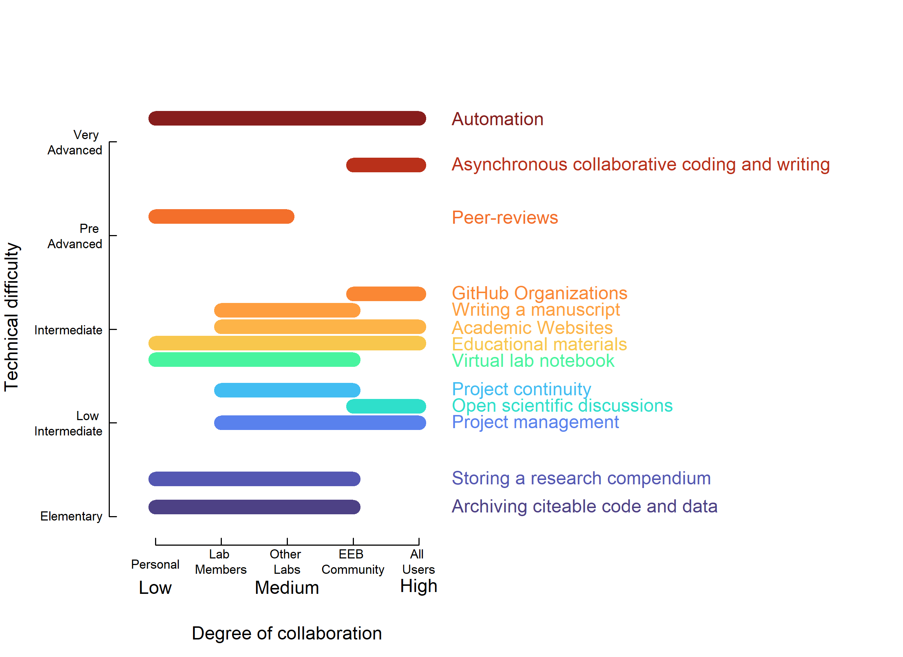

```{r setup, include=FALSE}
knitr::opts_chunk$set(echo = TRUE)
library(googlesheets4)
library(here)
library(readr)
scatterblob_data <- read_csv(here("data", "scatterblob_data_raw.csv"))
uses <- scatterblob_data$`Ways to use GitHub`
column_names <- colnames(scatterblob_data[1:8])
```

**Goal**: This is a summary figure, e.g., here are all the ways and here are the entry points with low technical difficulty, some for beginners and some more advanced ways to use GitHub.

**Highlight**: There are ways to use github that allow different degrees of collaboration that do not require too many technical skills.

## The data

Data was assembled collaboratively using Google docs, then manually saved as a "csv" file called `scatterblob_data_raw.csv` in the `data` folder.

The collaborative [google spread sheet](https://docs.google.com/spreadsheets/d/1zCRgctjfjE2xZN9MkqfFh222K6bvVvA3gT0UdkL_CS8/edit#gid=0), features a first column listing the ways to use GitHub that were addressed in the manuscript (`r paste0(uses[1:12], collapse = "; " )`).

The column *`r column_names[6]`* corresponds to the degree of difficulty that was perceived by the authors when assembling the data, based on personal experience. We quickly realized this varied greatly across authors, and that this variation seemed to depend on which github tools were previously known or mastered by the authors.

The columns tagged as *Cognitive load -* showcase a different way to assess technical difficulty of GitHub uses, measured as cognitive load (explained in the next section).

The columns tagged as *degree of collaboration* showcase the span of collaboration that can be achieved with each tool, as perceived by the authors.

### Measuring degree of technical difficulty

[Cognitive load](https://docs.google.com/spreadsheets/d/1YipCCdg5Z8w-IQO67rFfMBSTpLjO-_7HiW44gqzTXPM/edit#gid=0) was measured as follows:

1.  We first created a list of skills that are needed to implement different GitHub uses. These occupied a column each.
2.  For each GitHub use listed on the first column, we went through each column, and marked a 1 if a skill was needed for that particular GitHub use, and 0 if the skill was not needed.
3.  The sum of values across columns provides a measure of cognitive load required for a user that is a "GitHub beginner" to implement any GitHub use. The column *`r column_names[3]`* reflects this number.
4.  As many GitHub uses tied with the same cognitive load value, we resourced to perceived difficulty to break ties and avoid overlap of uses in the figure, mainly to improve visualization of the data. The column *`r column_names[5]`* shows this adjustment.
5.  Finally, we ordered the GitHub uses in increasing order following *`r column_names[5]`*, and assigned a sequential value of cognitive load, from 1 to *maximum number of GitHub uses*. This is column *`r column_names[4]`*

## Reading the data CSV file:

```{r}
scatterblob_data <- read_csv(here("data", "scatterblob_data_raw.csv"))
head(scatterblob_data)
#  View(scatterblob_data)
```

Cleaning the raw data and saving it as a `my_data` object:

```{r}
names(scatterblob_data)
scatterblob_data$x1 <- scatterblob_data$`Min degree of collaboration X1`
scatterblob_data$x2 <- scatterblob_data$`Max degree of collaboration X2`
scatterblob_data$y_real <- scatterblob_data$`Cognitive load - real - non-overlapping`
scatterblob_data$y_seq <- scatterblob_data$`Cognitive load - sequential`
my_data <- scatterblob_data[1:13,c("Ways to use GitHub","y_seq", "y_real", "x1", "x2")]
my_data
```

## Plotting the data

```{r}
outpath <- here("content", "images")
```

### 1) Using raw cognitive values.

Define colors:

```{r}
some_colors <- viridis::turbo(n = nrow(my_data), alpha = 0.9)

some_colors1 <- viridis::turbo(n = 30, alpha = 0.9)

some_colors2 <- viridis::magma(n = 30, alpha = 0.9)

plot(1:30, 1:30, col = some_colors2, pch = 8)
```

```{r}
my_colors <- some_colors1[c(2:3, 5,
                           8, 10, 12,
                           20, 21, 22, 23, 24,
                           28, 30)]

plot(1:length(my_colors), 
     1:length(my_colors), 
     col = my_colors, pch = 8)

```

```{r}
###############################################################
# start the pdf/png connection and set graphical parameters
###############################################################
# plot_format <- "pdf"
# plot_format <- "svg"
 plot_format <- "png"

if (plot_format == "pdf") {
  pdf(file = here(outpath, "scatterblob_0.pdf"),
      width = 8.25,
      height = 6,
      bg = "white")  
}
if (plot_format == "svg") {
  svg(filename = here(outpath, "scatterblob_0.svg"),
      width = 8.25,
      height = 6,
      bg = "white")  
}
if (plot_format == "png") {
  png(file = here(outpath, "scatterblob_0.png"),
      width = 8.25,
      height = 6,
      units = "in",
      res = 300,
      bg = "white")  
}
par(xpd = NA,
    mai = c(1.02, 1, 0.82, 4),
    bty="n")
###############################################################
# create the plot background
###############################################################
plot(x = c(0.5, 5.5),
     y = c(1.75, 10.75),
     xlab = "",
     ylab = "",
     col = "white",
     # "hide" the tick labels so we can put some words instead of numbers:
     col.axis = "white",
     tck = 0.02)
title(ylab="Technical difficulty", line=4, cex.lab=1)
title(xlab="Degree of collaboration", line= 3.5, cex.lab=1)
###############################################################
# add tick labels
###############################################################
text(x = 1:5,
     y = c(1, rep(1.05, 4)),
     cex = 0.7,
     labels = c("Personal",
                "Lab \nMembers",
                "Other \nLabs",
                "EEB \nCommunity",
                "All \nUsers"))
text(x = c(1, 3, 5),
     y = 0.5,
     labels = c("Low", "Medium", "High"))
# Technical difficulty levels from https://www.londonschool.com/level-scale/
text(x = 0.2,
     y = c(2, 4, 6, 8, 10),
     cex = 0.7,
     adj = 1,
     labels = c("Elementary",
                "Low \nIntermediate",
                "Intermediate",
                "Pre \nAdvanced",
                "Very \nAdvanced"))
###############################################################
# plot scatter blobs
###############################################################
for (i in seq(nrow(my_data))) {
  X0 <- my_data$x1[i]
  X1 <- my_data$x2[i]
  Y <- my_data$y_real[i]
  if (X0 == X1) {
    X0 <- X0 - 0.01
    X1 <- X1 + 0.01
   }
  segments(x0 = X0,
           x1 = X1,
           y0 = Y,
           col = my_colors[i],
           lwd = 13)
}
###############################################################
# add github uses text
###############################################################
text(x = 5.5,
    y = my_data$y_real,
    labels = my_data$`Ways to use GitHub`,
    adj = 0,
    col = my_colors)
dev.off()
```



### 2) Distributing cognitive load evenly:

We tried different color palettes from two different R packages: [viridis](https://cran.r-project.org/web/packages/viridis/vignettes/intro-to-viridis.html#the-color-scales) and [wesanderson](https://github.com/karthik/wesanderson#readme):

```{r}
some_colors3 <- viridis::turbo(n = 100, alpha = 0.9)
some_colors4 <- wesanderson::wes_palette("Zissou1", 75, type = "continuous")
some_colors5 <- wesanderson::wes_palette("Darjeeling1", 75, type = "continuous")
some_colors6 <- wesanderson::wes_palette("Darjeeling2", 75, type = "continuous")
some_colors7 <- wesanderson::wes_palette("Royal2", 75, type = "continuous")
plot(1:75, 1:75, col = some_colors7, pch = 8)
```

We agreed that viridis-turbo was the nicest palette for the purposes of our figure.

```{r}
my_colors <- some_colors3[c(2, 5, 15,
                           26, 28, 30,
                           68, 72, 76, 80, 84,
                           94, 100)]
plot_name <- "scatterblob_1-viridis-turbo"
# my_colors <- some_colors4[round(my_data$y_real*10)-20]
# plot_name <- "scatterblob_1-zissou1"
# my_colors <- some_colors5[round(my_data$y_real*10)-20]
# plot_name <- "scatterblob_1-darjeeling1"
# my_colors <- some_colors6[round(my_data$y_real*10)-20]
# plot_name <- "scatterblob_1-darjeeling2"
# my_colors <- some_colors7[round(my_data$y_real*10)-20]
# plot_name <- "scatterblob_1-royal2"
###############################################################
# start the pdf/png/svg connection and set graphical parameters
###############################################################
# plot_format <- "pdf"
plot_format <- "png"
# plot_format <- "svg"

if (plot_format == "pdf") {
  pdf(file = here(outpath, paste0(plot_name, ".pdf")),
      width = 8.25,
      height = 6,
      bg = "white")  
}
if (plot_format == "svg") {
  svg(filename = here(outpath, paste0(plot_name, ".svg")),
      width = 8.25,
      height = 6,
      bg = "white")  
}
if (plot_format == "png") {
  png(file = here(outpath, paste0(plot_name, ".png")),
      width = 8.25,
      height = 6,
      units = "in",
      res = 300,
      bg = "white")  
}
par(xpd = NA,
    mai = c(1.02, 1, 0.82, 4),
    bty="n")
###############################################################
# create the plot background
###############################################################
plot(x = c(0.5, 5.5),
     y = c(0.4, 14),
     xlab = "",
     ylab = "",
     col = "white",
     # "hide" the tick labels so we can put some words instead of numbers:
     col.axis = "white",
     tck = 0.02)

title(ylab = "Technical Difficulty", 
      line = 4, 
      cex.lab = 1)

title(xlab = "Degree of Collaboration", 
      line = 3.5, 
      cex.lab = 1)
###############################################################
# add tick labels
###############################################################
text(x = 1:5,
     y = c(-0.65, rep(-0.7, 4)), 
     cex = 0.7,
     labels = c("Personal", 
                "Lab \nMembers", 
                "Other \nLabs", 
                "EEB \nCommunity", 
                "All \nUsers"))
text(x = c(1, 3, 5),
     y = -1.7, 
     labels = c("Low", "Medium", "High"))
# Technical difficulty levels from https://www.londonschool.com/level-scale/
text(x = 0.2,
     y = seq(1, 13, length.out = 5),
     cex = 0.7,
     adj = 1,
     labels = c("Beginner",
                "Low\nIntermediate",
                "Intermediate", 
                "Pre \nAdvanced",
                "Advanced"))
###############################################################
# plot scatter blobs on sequential cognitive load
###############################################################
for (i in seq(nrow(my_data))) {
  X0 <- my_data$x1[i]
  X1 <- my_data$x2[i]
  Y <- my_data$y_seq[i]
  if (X0 == X1) {
    X0 <- X0 - 0.01
    X1 <- X1 + 0.01
   }
  segments(x0 = X0,
           x1 = X1,
           y0 = Y,
           col = my_colors[i],
           lwd = 23)
}
###############################################################
# add github uses text
###############################################################
text(x = 5.5,
    y = my_data$y_seq,
    labels = my_data$`Ways to use GitHub`,
    adj = 0,
    col = my_colors)
dev.off()
```


