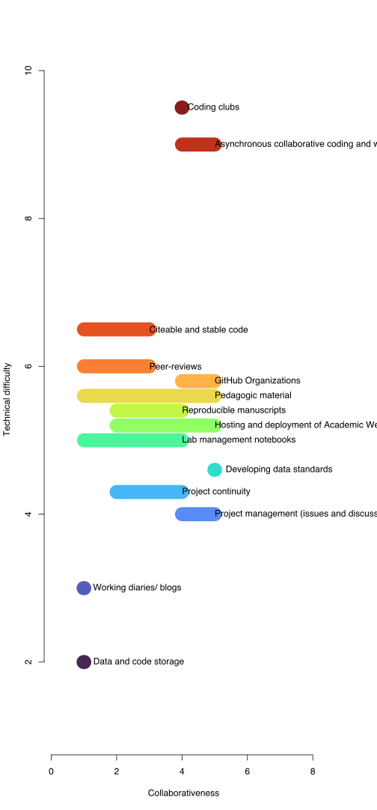
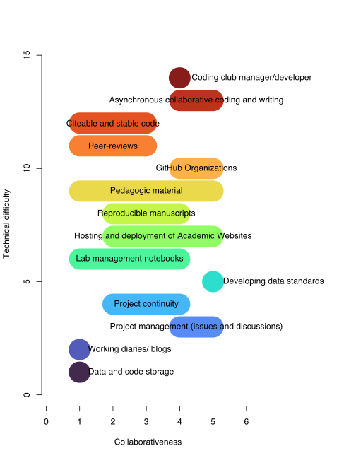

```{r setup, include=FALSE}
knitr::opts_chunk$set(echo = TRUE)
```

Goal: This is a summary figure, e.g., "here are all the ways and here are the entry points with low technical difficulty, and some  for beginner s and the more advanced ways to use it".
There are ways to use github that allows different degrees of collaboration that do not require too many technical skills.

Use even notation across text and figure

space out middle blobs
labels to x and y axis
homogenizing titles of ways to use github

## The data

Data for this figure was generated on a collaborative [google spread sheet](https://docs.google.com/spreadsheets/d/1Ls0DofQWSZQsqtP4OLFj326sGfWsklrI2tA1GNUTR6g/edit#gid=0). Cognitive load [was measured in a different file](https://docs.google.com/spreadsheets/d/1OLBR3M0uV3PMSazWUYHgPeX28wllAgS4PIlJXaNu-2o/edit#gid=0). 

Reading the data csv file:

```{r}
library(readr)
scatterblob_data <- readr::read_csv("scatterblob_data.csv")
View(scatterblob_data)
```

Creating the `my_data` object from :

```{r}
names(scatterblob_data)
scatterblob_data$x1 <- scatterblob_data$`Degree of immediate collaborativeness X1`
scatterblob_data$x2 <- scatterblob_data$`Degree of immediate collaborativeness X2`
scatterblob_data$y <- scatterblob_data$`Cognitive load absolute`

scatterblob_data$`Cognitive load` <- c(2,3,4,4.3,4.6,5,5.2,5.4,5.6,5.8,6,6.5,9,9.5)

my_data <- scatterblob_data[,c("Ways to use GitHub","y", "x1", "x2")]
my_data
```


## Plotting the data

### First try

Using original cognitive values.

```{r}
my_colors <- viridis::turbo(n = nrow(scatterblob_data), alpha = 0.9)

svg(filename = "scatterblob_0.svg", width = 7, height = 11, bg = "white")

par(xpd = TRUE, mai = c(1.02, 0.82, 0.82, 1), bty="n")

plot(x = c(0.1,8), 
     y = c(1.1,10), 
     xlab = "Collaborativeness",
     ylab = "Technical difficulty",
     col = "white")

for (i in seq(nrow(scatterblob_data))) {
  X0 <- scatterblob_data$x1[i]
  X1 <- scatterblob_data$x2[i]
  Y <- scatterblob_data$`Cognitive load`[i]
  if (X0 == X1) {
    X0 <- X0 - 0.01
    X1 <- X1 + 0.01
    adj_text <- -0.1
   } else {
    adj_text <- 0.5
   }
  segments(x0 = X0,
           x1 = X1,
           y0 = Y,
           col = my_colors[i],
           lwd = 20)
   text(x = median(c(X0, X1)), 
       y = Y, 
       labels = my_data$`Ways to use GitHub`[i],
       adj = adj_text)
}
dev.off()
```



### Second try

Distributing cognitive load evenly:

```{r}
my_colors <- viridis::turbo(n = nrow(scatterblob_data), alpha = 0.9)

svg(filename = "scatterblob.svg", width = 7, height = 9, bg = "white")
par(xpd = TRUE, mai = c(1.02, 0.82, 0.82, 2), bty="n")
plot(x = c(0.1,6), 
     y = c(0.1,15), 
     xlab = "Collaborativeness",
     ylab = "Technical difficulty",
     col = "white")

for (i in seq(nrow(scatterblob_data))) {
  X0 <- my_data$x1[i]
  X1 <- my_data$x2[i]
  Y <- my_data$y[i]
  if (X0 == X1) {
    X0 <- X0 - 0.01
    X1 <- X1 + 0.01
    adj_text <- -0.1
   } else {
    adj_text <- 0.5
   }
  segments(x0 = X0,
           x1 = X1,
           y0 = Y,
           col = my_colors[i],
           lwd = 40)
   text(x = median(c(X0, X1)), 
       y = Y, 
       labels = my_data$`Ways to use GitHub`[i],
       adj = adj_text)
}
dev.off()
```




